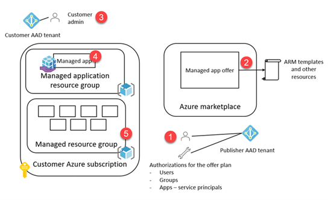
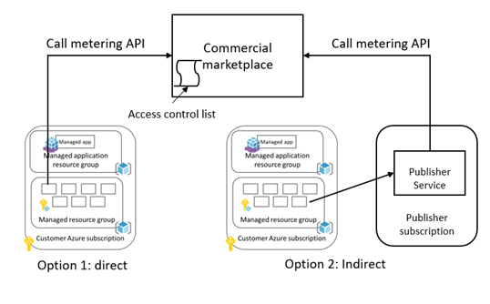
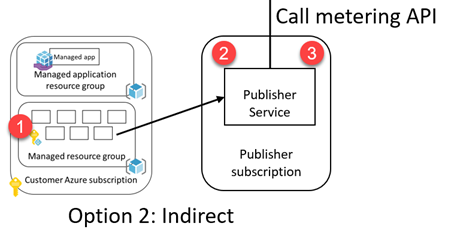

# Posting custom meters for a Commercial Marketplace managed app offer

I have been working with a few teams to help them use managed app offers with custom meters. I would like to consolidate my notes here for the general public's consumption. Usual disclaimer apply, this is sample only, use it at your own risk, understand the concepts throughly before implementing your own. 

What you need to know
- Deploying resources to Azure subscriptions
- Azure Active Directory (AAD) concepts, such as users, groups, application registrations, service principals, authenticating with AAD, and auhorizing access to resources
- Role based access control (RBAC) on Azure
- Managed applications
- Calling marketplace APIs

Here is what we will cover in this article.

- [Posting custom meters for a Commercial Marketplace managed app offer](#posting-custom-meters-for-a-commercial-marketplace-managed-app-offer)
  - [Managed applications overview](#managed-applications-overview)
  - [Posting usage data to Commercial Marketplace using metering APIs](#posting-usage-data-to-commercial-marketplace-using-metering-apis)
    - [Option 1 - calling the metering API directly from the managed resource group](#option-1---calling-the-metering-api-directly-from-the-managed-resource-group)
      - [Code running on a VM](#code-running-on-a-vm)
        - [Getting an access token](#getting-an-access-token)
        - [Getting the value for resourceUri or resourceId](#getting-the-value-for-resourceuri-or-resourceid)
      - [Using an Azure Web App](#using-an-azure-web-app)
    - [Option 2 - calling the metering API from a central service](#option-2---calling-the-metering-api-from-a-central-service)
  - [Accompanying templates](#accompanying-templates)
    - [VM running as user assigned managed identity](#vm-running-as-user-assigned-managed-identity)
    - [VM running as system assigned managed identity](#vm-running-as-system-assigned-managed-identity)
    - [VM running as user assigned managed identity having access to managed app](#vm-running-as-user-assigned-managed-identity-having-access-to-managed-app)

## Managed applications overview

The [Azure documentation for managed applications](https://docs.microsoft.com/en-us/azure/azure-resource-manager/managed-applications/overview) says this:

> Azure managed applications enable you to offer cloud solutions that are easy for consumers to deploy and operate. You implement the infrastructure and provide ongoing support. To make a managed application available to all customers, publish it in the Azure marketplace. To make it available to only users in your organization, publish it to an internal catalog.

Here is how marketplace managed apps work.

1. Publisher creates a managed app offer on Partner Center, with at least one plan having assets, as mainTemplate.json, createUIDefinition.json and other resources such as scripts, files, and linked templates. Assigns authorizations for the plan. These can be users, groups and service principals for apps.
2.  Publisher publishes the offer to Azure Marketplace.
3. Customer locates the offer on Azure Marketplace and subscribes to it.
4. This action creates a Managed Application (Azure resource type, **Microsoft.Solutions/applications**) resource in a resource group of customer's choosing.
5. It also creates a managed resource group where the resources defined in the maintemplate.json in step (2) are deployed to.
6. The template also needs to define a managed identity that is also deployed along with those resources. I will explain this later.



At the end of this operation, the various identities, such as the customer admin, the ones listed on the authorizations and the managed identity can do the following:
- Identities on the offer plan authorizations list can
    - Be an owner or contributor to the resources in the managed resource group (5)
    - Read the managed app created in (4) 
- Customer admin
    - Has the full control on the managed app (4), can delete it, and when he/she deletes it, the managed resource group (5) is also deleted, along with managed resources
    - Has read access to managed resource group (5)
- Managed identity
    - Needs to have at least read permission requested on the managed resource group (5) in the maintemplate.json

## Posting usage data to Commercial Marketplace using metering APIs

You can take two approaches when posting usage using the metering APIs.
1. Post directly by the deployed resources on the customer deployments.
2. Send usage data to your central service you maintain, and post from there.

When going through those routes, you will need the following.
1. An access token assigned by Azure Active Directory for a principal that can call the marketplace API (as defined by the resource id 20e940b3-4c77-4b0b-9a53-9e16a1b010a7/.default). The principal can be multiple types, user, AAD app registration, managed identity etc. This will be included in the authorization header of the request in bearer scheme. Depending on where you are calling the metering API from, this can be assigned to different principals. We will talk about how a managed identity can be used to call the API if you are calling from within the deployed resources, or how an Azure Active Directory App registration can be used to achieve the same from a central services.
2. The value for **resourceId**, or **resourceUri** for posting the meter against. 
   1. **resourceId** can be SaaS offer subscription ID for the SaaS offers, or **billingDetails.resourceUsageId** property if the managed application
   2. **resourceUri** is only applicable for managed applications, and it is the resource id of the managed application that looks like '*/subscriptions/bf7adf12-c3a8-426c-9976-29f145eba70f/resourceGroups/ercmngd/providers/Microsoft.Solutions/applications/userassigned1013*'



To summarize, here is how it looks

API calling location | Getting the token | Getting the resourceUri or resourceId
---------------------|-------------------|--------------------------------------
Option 1: Call metering API directly | 1. Use a managed identity <br> 2. Use AAD app registration and pass the client secret | Use Azure management API to get resourceUri or resourceId
Option 2: Call metering API from a central service | Use an explicit AAD app registration | Use Azure management API to get resourceUri or resourceId

<br>


Let's see how you can get those and post a custom meter request. You will need to have code running in both cases on the managed resource group in a resource. I am going to use a VM or Web App in both of the options for hosting the code and demonstrate how you can get the access token (1) and the value for resourceId (or resourceUri) for posting the meters to.

### Option 1 - calling the metering API directly from the managed resource group


#### Code running on a VM


You will need to implement following in your ARM template
1.  Have a [user assigned managed identity](https://github.com/Ercenk/ManagedAppCustomMeters/blob/master/src/appArtifacts/user-assigned/mainTemplate.json#L171), or a system assigned managed identity. If you chose to use system assigned managed identity, please see the sample [here](https://github.com/Azure-Samples/commercial-marketplace-managed-application-metering-samples/blob/main/src/system-assigned/mainTemplate.json#L252).
2.  [Assign it to the VM ](https://github.com/Ercenk/ManagedAppCustomMeters/blob/master/src/appArtifacts/user-assigned/mainTemplate.json#L182), if you are using system assigned managed identity, see [here](https://github.com/Azure-Samples/commercial-marketplace-managed-application-metering-samples/blob/main/src/system-assigned/mainTemplate.json#L195).
3.  Give [Reader access to the resource group](https://github.com/Ercenk/ManagedAppCustomMeters/blob/master/src/appArtifacts/user-assigned/mainTemplate.json#L245) 
4.  Set [**delegatedManagedIdentityResourceId** property](https://github.com/Ercenk/ManagedAppCustomMeters/blob/master/src/appArtifacts/user-assigned/mainTemplate.json#L248) to make the connection with the managed app 

##### Getting an access token 
Now let's see how you can get the access token. You can get a token with one of the two methods.
1. Use the managed identity provisioned in the template. We will demonstrate this approach below.
2. Use the AAD App registration details on the "Technical details" tab of the offer on Partner Center. You need to pass in the client secret in a safe way to be able to request a token for this app. Please see the [sample](https://github.com/arsenvlad/azure-managed-app-publisher-secret) demonstrating how you can extend a secret from a Key Vault managed by the publisher to another Key Vault deployed as a part of the managed application.


Let's move on to see how you can use the managed identity to request an access token. We need to access the metadata URL for the VM to get this token as follows.

``` PowerShell
    $metadataTokenUrl = "http://169.254.169.254/metadata/identity/oauth2/token?api-version=2018-02-01&resource=20e940b3-4c77-4b0b-9a53-9e16a1b010a7"
    $marketplaceToken = Invoke-RestMethod -Headers @{"Metadata" = "true"} -Uri $managementTokenUrl 
```

Notice we are requesting this token for the marketplace API resource with the id **20e940b3-4c77-4b0b-9a53-9e16a1b010a7** see [this document for details ](https://docs.microsoft.com/en-us/azure/marketplace/partner-center-portal/pc-saas-registration#request-body:~:text=Target%20resource%20for%20which%20the%20token,the%20target%20resource%20in%20this%20case.)
And the reason this token will work is because of step (4) above for the ARM template.

##### Getting the value for resourceUri or resourceId

Next up is how to get the **resourceUri** value. In order to get that, we need to take multiple steps.


1.  On the VM, grab a token for management API from the metadata endpoint. Notice the resource we are requesting the token for, this time it is https://management.azure.com, the Azure management API
``` PowerShell
    $metadataTokenUrl = "http://169.254.169.254/metadata/identity/oauth2/token?api-version=2018-02-01&resource=https%3A%2F%2Fmanagement.azure.com%2F"
    $Token = Invoke-RestMethod -Headers @{"Metadata" = "true"} -Uri $managementTokenUrl 
 ```

2.	Call the metadata endpoint to grab the subscription ID and resource group name
``` PowerShell
    $Headers = @{}
    $Headers.Add("Authorization","$($Token.token_type) "+ " " + "$($Token.access_token)")
    $metadataUrl = "http://169.254.169.254/metadata/instance?api-version=2019-06-01"
    $metadata = Invoke-RestMethod -Headers @{'Metadata'='true'} -Uri $metadataUrl 
```

3.	We will use the values for subscription ID and resource group name to call management API to get the managed app details. This will give you something like /subscriptions/bf7adf12-c3a8-426c-9976-29f145eba70f/resourceGroups/ercmngd/providers/Microsoft.Solutions/applications/userassigned1112
``` PowerShell
    $managementUrl = "https://management.azure.com/subscriptions/" + $metadata.compute.subscriptionId + "/resourceGroups/" + $metadata.compute.resourceGroupName + "?api-version=2019-10-01"
    $resourceGroupInfo = Invoke-RestMethod -Headers $Headers -Uri $managementUrl 
    $managedappId = $resourceGroupInfo.managedBy 
```

4. Now let's use the code at the top to get the token for calling marketplace APIs
``` PowerShell
    $metadataTokenUrl = "http://169.254.169.254/metadata/identity/oauth2/token?api-version=2018-02-01&resource=20e940b3-4c77-4b0b-9a53-9e16a1b010a7"
    $marketplaceToken = Invoke-RestMethod -Headers @{"Metadata" = "true"} -Uri $managementTokenUrl 
```

5. At this point we have the token to call the metering API with, plus all of the details. But first we need to adjust some details for the service client, since marketplace API implements TLS 1.2.

``` PowerShell
    [Net.ServicePointManager]::SecurityProtocol = [Net.SecurityProtocolType]::Tls11, [Net.SecurityProtocolType]::Tls12;
```

5. Now TLS 1.2 is out of the way, and we have the token, let's build the payload. Notice the trick I am using to make sure I am reporting for this hour only with a 5 minute delay.

``` PowerShell
    $lastHourMinusFiveMinutes = (Get-Date).AddMinutes(-65).ToString("yyyy-MM-ddTHH:mm:ssZ")

    $body = @{ 'resourceUri' = $managedappId; 'quantity' = 15; 'dimension' = 'dim1'; 'effectiveStartTime' = $lastHourMinusFiveMinutes; 'planId' = 'userassigned'} | ConvertTo-Json
    
```

6. And post the meter, notice the content type header.
``` PowerShell
    $Headers = @{}
    $Headers.Add("Authorization","$($marketplaceToken.token_type) "+ " " + "$($marketplaceToken.access_token)")

    $response = Invoke-RestMethod 'https://marketplaceapi.microsoft.com/api/usageEvent?api-version=2018-08-31' -Method 'POST' -ContentType "application/json" -Headers $Headers -Body $body -Verbose
```

What if we want to use resourceId instead of resourceUri? For that case, your managed identity needs to have at least Read permissions on the Managed Application resource itself. You can achieve this by using an incremental deployment in an ARM template. Let's see how it works. Following snippet demonstrates how you can a nested deployment in an ARM template with an embedded template marked with incremental deployment mode.


``` json
  "variables": {
    ....
    "networkSecurityGroupName": "default-NSG",
    "managedApplicationId": "[resourceGroup().managedBy]",
    "managedApplicationName": "[last(split(variables('managedApplicationId'), '/'))]",
    "roleId": "acdd72a7-3385-48ef-bd42-f606fba81ae7"
  },
  ...
    {
      "apiVersion": "2019-04-01-preview",
      "name": "[guid(resourceGroup().id)]",
      "type": "Microsoft.Authorization/roleAssignments",
      "dependsOn": [
        "[resourceId('Microsoft.Compute/virtualMachines', variables('vmName'))]"
      ],
      "properties": {
        "roleDefinitionId": "[subscriptionResourceId('Microsoft.Authorization/roleDefinitions', variables('roleId'))]",
        "principalId": "[reference(concat('Microsoft.ManagedIdentity/userAssignedIdentities/',concat(variables('vmName'), 'ManagedIdentity'))).principalId]",
        "scope": "[resourceGroup().id]",
        "principalType": "ServicePrincipal",
        "delegatedManagedIdentityResourceId": "[resourceId('Microsoft.ManagedIdentity/userAssignedIdentities', concat(variables('vmName'), 'ManagedIdentity'))]"
      }
    },
    {
      "type": "Microsoft.Resources/deployments",
      "apiVersion": "2017-05-10",
      "name": "roleAssignmentNestedTemplate",
      "resourceGroup": "[resourceGroup().name]",
      "properties": {
        "mode": "Incremental",
        "template": {
          "$schema": "https://schema.management.azure.com/schemas/2015-01-01/deploymentTemplate.json#",
          "contentVersion": "1.0.0.0",
          "resources": [
            {
              "type": "Microsoft.Solutions/applications/providers/roleAssignments",
              "apiVersion": "2019-04-01-preview",
              "name": "[concat(variables('managedApplicationName'), '/Microsoft.Authorization/', newGuid())]",
              "properties": {
                "roleDefinitionId": "[concat(subscription().id, '/providers/Microsoft.Authorization/roleDefinitions/', variables('roleId'))]",
                "principalId": "[reference(concat('Microsoft.ManagedIdentity/userAssignedIdentities/',concat(variables('vmName'), 'ManagedIdentity'))).principalId]",
                "delegatedManagedIdentityResourceId": "[resourceId('Microsoft.ManagedIdentity/userAssignedIdentities', concat(variables('vmName'), 'ManagedIdentity'))]",
                "scope": "[variables('managedApplicationId')]",
                "principalType": "ServicePrincipal"
              }
            }
          ]
        }
      },
      "dependsOn": [
        "[concat('Microsoft.Compute/virtualMachines/', variables('vmName'))]"
      ]
    }
```
Once the user assigned managed identity is assigned the appropriate role to the managed application, run the steps 1 through 3 to get an access token as well as the managed application's resource id. Then call the following to get the **resourceUsageId**.

Please see this [sample](./src/user-assigned-nested/mainTemplate.json) for using a nested deployment to assign the appropriate access to the managed application itself to read the resourceUsageId property.

``` PowerShell
## resource usage id
# Get resourceUsageId from the managed app

$managedAppUrl = "https://management.azure.com" + $managedappId + "\?api-version=2019-07-01"
$managedApp = Invoke-RestMethod -Headers $Headers -Uri $managedAppUrl  

$resourceUsageId = $ManagedApp.properties.billingDetails.resourceUsageId
```

#### Using an Azure Web App

**Coming soon**

### Option 2 - calling the metering API from a central service

Let's first look at the various identities that needs to access resources for reading data and calling the metering APIs.



1. Managed identity needs to have at least read access to the managed resource group, so it can read the Azure subscription id of the customer, the managed resource group id. This information is available through the metadata url on Virtual Machines. The VM deployed on the managed resource group tracks the usage and reports it to the publisher service.
2. The publisher service uses the AAD app registration added to the plan authorizations list on the Partner Center to access the **billingProperties** property of the managed app by calling the Azure management APIs.
3. The publisher service calls the metering API using the AAD app registration details provided in the "Technical configuration" tab of the offer to post to the metering API.

Now let's go through setting this up. 

I am assuming you already have a published (or in preview) managed app that has at least one VM in it, with RBAC configured so the managed identity it is running under has access to the managed resource group. [Please see this as an example](https://github.com/Ercenk/marketplacemanagedappwithmeters/blob/master/artifacts/user-assigned/mainTemplate.json#L250). 

I am also assuming you have an AD group ID added to the authorizations list on your offer's plan's technical configuration page.

1. Make a new app registration on Azure AD to eventually call the management APIs.

```
    az ad app create --display-name "ErcAppManager"
```    

    Get the id of the registered app with 

```    
    az ad sp list --query "[?displayName=='ErcManagedApp2'].{appId:appId}"
```    

For example the above command returns the following
```
    [
        {
            "appId": "74a5e576-bf02-4a23-add8-a031c5820b14"
        }
    ]
```

Also get the objectId of the service principal with the following

```
    az ad sp list --query "[?displayName=='ErcManagedApp2'].{objectId:objectId}"
```

It should return something like this
```
    [
        {
            "objectId": "7ca20ed0-5d9b-43ef-a991-527d2c386a18"
        }
    ]
```

2. Add the app registration to the AD group recorded in the authorizations list, alternatively, find the service principal for the app registration on "Enterprise applications" list on your directory, and add the object ID of the SP to the authorizations list.


3. Now we will simulate an application calling Azure Management API to access the managed app
4. Go to Azure Portal, Azure Active Directory blade, find your newly created app registration, click on Certificates & secrets and add a secret. Copy the secret, you will not be able to access it again.
4. Open a command line, and type in the following 
    4.1 Request an access token
```
        curl -X POST -d 'grant_type=client_credentials&client_id=[APP_ID]&client_secret=[PASSWORD]&resource=https%3A%2F%2Fmanagement.azure.com%2F' https://login.microsoftonline.com/[TENANT_ID]/oauth2/token
```    

Now copy the value of the return access_token, and insert into the following cUrl call. We are assuming your code in the deployed VM will be providing the subscription 

```
    curl -X GET -H "Authorization: Bearer [TOKEN]" -H "Content-Type: application/json" https://management.azure.com/subscriptions/[SUBSCRIPTION_ID]//resourceGroups/[RESOURCEGROUPFORTHEMANAGEDAPP]/providers/Microsoft.Solutions/applications/[MANAGEDAPPNAME]?api-version=2019-07-01 | jq
```

This should return the  **billingDetails** property with **resourceUsageId**.

Now you need to get an access token for your AAD app registration for calling the metering APIs, you have resourceId (resourceUsageId value from above), and the count of the meter you want to post.

## Accompanying templates

There are three different templates with slightly varying structures to support the examples above. They demonstrate how the different approaches above can be used.
   - system-assigned: Used for all approaches except getting resourceUsageId from the billingDetails of the managed application
   - user-assigned: Used for all approaches except getting resourceUsageId from the billingDetails of the managed application
   - user-assigned-nested: Demonstrates how permissions can be set for getting resourceUsageId from the billingDetails of the managed application

All of the templates have the following resources. 

Internal deployment that sets the partner and customer usage attribution with a name starting with "pid-". The templates set either a user assigned managed identity or a system assigned managed identity to the VM.


1. Storage account as a diagnostics store for the VM
2. Public IP address for the VM
3. A network security group 
4. Virtual network
5. Network interface card
6. Virtual machine - approaches for identity are different in the samples
7. Role assignment - varies by approach
   
### VM running as user assigned managed identity
The template defines a user assigned managed identity resource (of type 'Microsoft.ManagedIdentity/userAssignedIdentities').

The VM runs under this managed identity. This identity assumes the reader role for the managed resource group and specifies the cross tenant access though '**delegatedManagedIdentityResourceId**' property.

We are setting the **delegatedManagedIdentityResourceId** to access the managed application's ID through the managed resource group's '**managedBy**'. That property needs a resource Id, and user assigned managed identity is a resource, so getting the resource ID is easy. Also notice how the principalId for this resource is set, we are accessing the user defined managed identity resource, and getting the principalId.

### VM running as system assigned managed identity

The VM runs under a system assigned managed identity. This identity assumes the reader role for the managed resource group and specifies the cross tenant access though '**delegatedManagedIdentityResourceId**' property. Notice how the principalId is set. This time the principalId is on the VM resource. Also, the value for the delegatedManagedIdentityResourceId property is slightly different, we are accessing the VM's resource ID.

We are setting the **delegatedManagedIdentityResourceId** to access the managed application's ID through the managed resource group's '**managedBy**'. That property needs a resource Id, and user assigned managed identity is a resource, so getting the resource ID is easy.


### VM running as user assigned managed identity having access to managed app

The template defines a user assigned managed identity resource (of type 'Microsoft.ManagedIdentity/userAssignedIdentities').

The VM runs under this managed identity. This identity assumes the reader role for the managed resource group and specifies the cross tenant access though '**delegatedManagedIdentityResourceId**' property.

The template then defines a nested template to be run after this deployment complete. Important note is to use 'incremental' mode on this template. The template defines a role assignment resource that assigns the reader role for the user assigned managed identity to the managed application created in the main template. Please notice the 'scope' property for the role assignment.

The additional nested template named 'outputsForDeployent' is used for debugging.
